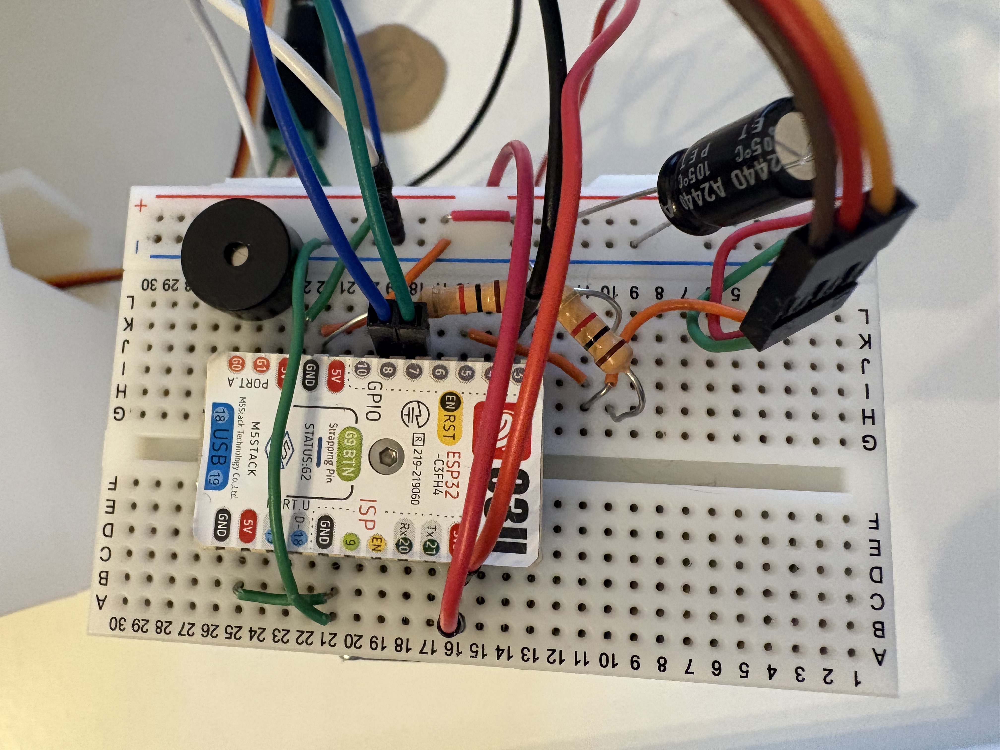
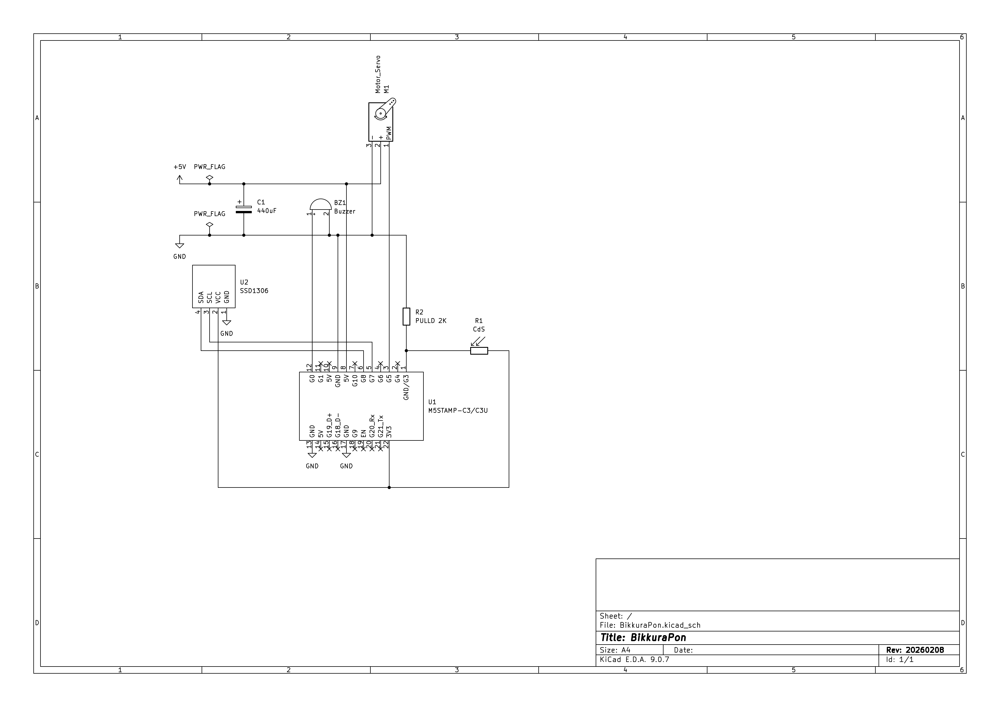

# What
びっくらポンもどき
お皿を入れると、抽選。当たると、カプセルトイが出るよ。

# Parts

| Ref | Parts            | Name                 |
|-----|------------------|----------------------|
| U1  | Micro Controller | M5Stamp C3U      x 1 |
| U2  | OLED Display     | [0.96インチ 128×64ドット有機ELディスプレイ](https://akizukidenshi.com/catalog/g/g112031/) x 1 |
| M1  | Servo Motor      | MG996R (360 degree rotation)|
| C1  | Capacitor        | 470uF x 1            |
| R1  | Sensor           | [Cdsセル 光センサー](https://akizukidenshi.com/catalog/g/g100110/)|
| R2  | Resistance       | Carbon Resistance (2K ohm) |
| BZ1 | Buzzer           | [電子ブザー 12mm UDB-05LFPN](https://akizukidenshi.com/catalog/g/g109704/) |

# 3D Printings

* [3D models](./3d/)
* [Capsule 40mm](https://makerworld.com/ja/models/2265124-gacha-vending-capsules-multiple-sizes-styles)

# Circuit

