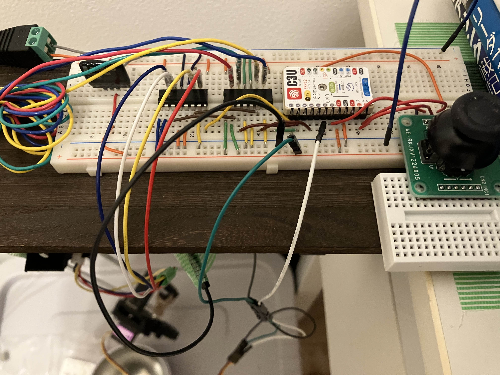
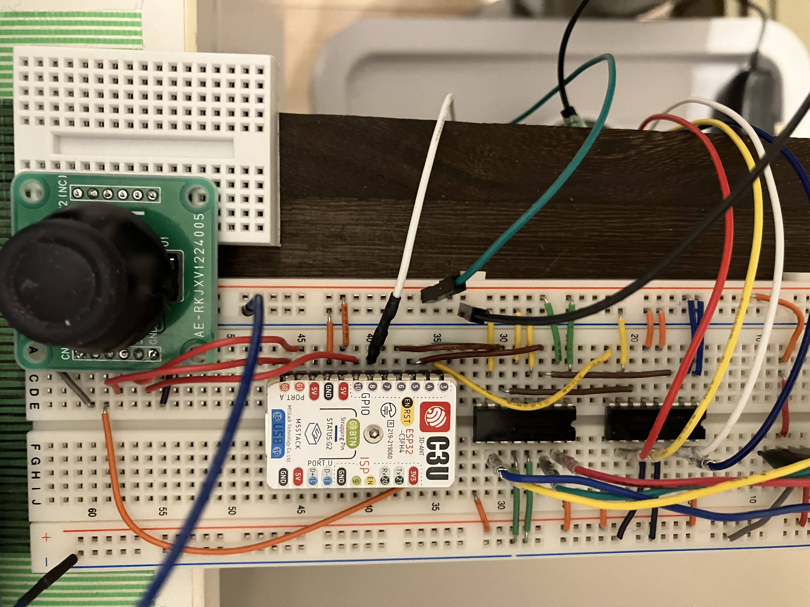
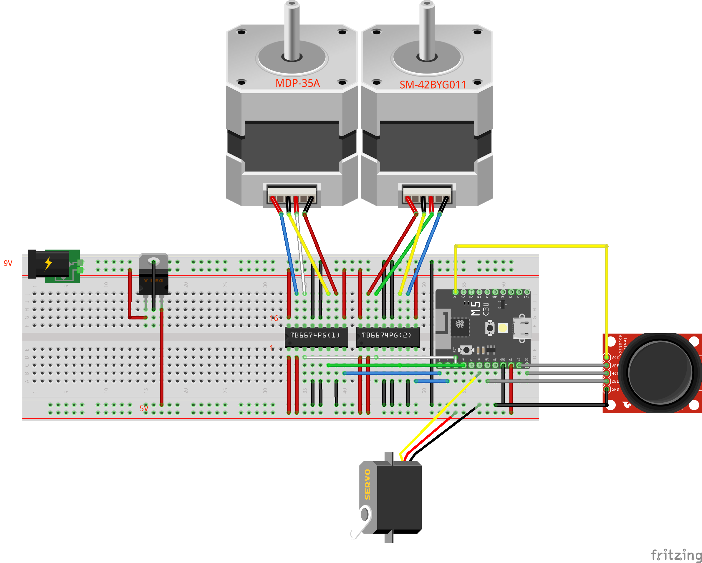

# What is this ?

CraneGame but it has only 2 axies.

# Parts

| Parts            | Name                 |
|------------------|----------------------|
| Micro Controller | M5Stamp C3U      x 1 |
| Motor Driver     | Toshiba TB6674PG x 2 |
| Bipolar Stepper Motor | MDP-35A     x 1 |
| Bipolar Stepper Motor | [SM-42BYG011](https://akizukidenshi.com/catalog/g/g105372/) x 1 |
| Servo Motor      | [TowerPro MG90S](https://akizukidenshi.com/catalog/g/g113227/)   x 1 |
| Capacitor        | 470uF                |
| Joystick Module  | [ジョイスティックRKJXV122400R DIP化キット](https://akizukidenshi.com/catalog/g/g115433/) |
| Linear DC/DC Regulator | [ROHM 5V BP5293-50](https://akizukidenshi.com/catalog/g/g111188/) |

# 3D Printings

* [Servo Gripper](https://www.thingiverse.com/thing:3056229)

# Breadboard

